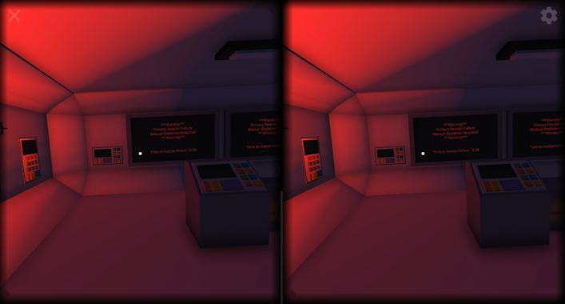
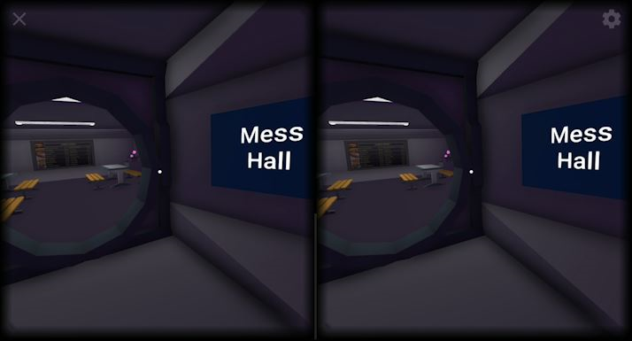

Name: Dave Johnston
Google VR SDK: Version 1.110.0

# Lost in Space
This is my **Capstone Project** for the Udacity VR Nanodegree program, called Lost in Space.  This is a short game, in which you are stranded on a ship in space, and have only minutes to shutdown the failing primary reactor to save yourself and the ship, or you will be lost in space forever.  In order to navigate throughout the ship, you must find several hidden key cards, that will grant you access through locked doors to different areas of the ship that you can explore.  This was a fun project to work on, and I really enjoyed using the skills that I learned throughout the VR Nanodegree program to make a fully interactive game for people to play. Below are a couple of screenshots of the game in VR mode.

The ship bridge, where the adventure starts

Look for the realistic pop can in the mess hall

## Installation
* If you own an Android phone, you can install the app by simply copying the `Lost In Space.apk` file from the **Build** directory onto your android device, and installing the apk by clicking on it from the file manager.
* If you own an iPhone, you will need to follow the instructions below for **contributing** to this app, and then switch to the iOS platform in build settings before rebuilding and running on your phone.

## Development
Before I even began developing my VR app for the Capstone project, I created a spreadsheet for pre-production planning, to help me understand what I needed to do, and to help organize my thoughts about how I intended to accomplish all of the achievments necessary to get a passing grade on the project.  You can view my spreadsheet [here](Documents/Project_Prep.xlsx).  On one tab in the spreadsheet, I also included some early drawings I created with my first vision of how the ship would look as well as some notes for game play mechanics.

As I began building my VR app, and implementing all of the necessary game mechanics to make everything work properly, I had to make sure and test various elements of the game several different times with friends and family members.  For each user test, I took good notes, and had to adjust different aspects of the game to make things more intuitive and help the overall gameplay.  You can view the results of each user test, as well as the updates I made based on the feedback I recieved, from the links below.

* [User Test 1](Documents/UserTest_1.docx)
* [User Test 2](Documents/UserTest_2.docx)

During the final stages of building my VR app, I discovered the post processing stack in the Unity store.  This nifty addition to my project uses scripts to improve the overall appearance of the VR objects in my application, while still maintaining a high rate of performance on a mobile device, by using the processing power of the computer being used for development during compilation and building of the app. Although this wasn't necessary for any of the achievments required for completion of this project, I still thought it was worth calling out.

You can view a video walkthrough of my app -> [here](https://youtu.be/u3nr0f7m6NM). 

Here is the list of achievements contained in my project, points scored, and a brief description of each:
**Fundamentals**
* Scale (100) - Verified proper scale of ship and objects during user testing
* Animation (100) - There are multiple doors of various types that can be opened by the user
* Lighting (100) - Used both baked and realtime lighting in variouis places aboard the ship
* Locomotion (100) - Used built-in navmesh component of Unity to allow player to move about freely by clicking on the floor (pretty proud of this accomplishment :-D)
* Physics (200) - Simulated gravity using navmesh, allowing player to only move on floor and steps, x2 if lighting achievment is completed
**Total: 600**

**Comleteness**
* Gamification (250) - Countdown timer to add pressure to find goal, key cards to control flow of game play
* Diegetic UI (250) - Using a point and click system for movement, lighted buttons, and color-coded key cards, it is easy for a user to figure out how to play this game right from the start
* Alternative Storyline (250) - Switch in the lab adds additional time to the countdown timer, which may just be the different between success and failure
* Photogrammetry (250) - Used photogrammetry app for smart phone to import a Diet Mountain Dew can in the Mess Hall
**Total: 1000**

**Challenges**
* User Testing (500) - Performed two very thorough user tests and recieved excellent feedback that helped shape the game mechanics and simplify gameplay. (Links to documents above)
**Total: 500**

## Lessons Learned
As with all of the projects I have done for the Udacity VR Nanodegree, I learned several lessons while working on my capstone project.  As my ship became bigger and bigger, I noticed the frame rate drop a little when running the app on a mobile device. After some research online, I discovered occlusion culling, which is a pretty nifty trick to reduce the number of draws needed for an app like this one, that is contained in a small areas like rooms and hallways, with doors between them.  I couldn't get the occlusion culling to work properly (I will do more research, because this definitely seems like a valuable skill to master), but it did lead me in the right direction. Instead, I "deactivated" entire sections of the ship, and only activated them when the door leading into a specific section was opened by the player. This definitely helped with performance on my mobile device. 

Another valuable lessoned learned was how to use the navmesh component of Unity - typically used for programming routes or limited AI for computer controlled players/objects - to move the player with a point and click method.  This made it very easy to navigate freely around the ship and explore, while excluding objects and obstacles that the user should not be able to walk on/through.  There were some hurdles with this tool though, like allowing users to move through doorways, but only after the door is opened, or creating a "cushion" so that the user does not get too close to walls or objects unintentially.  This feels like a very intuitive method for movement in VR, and I think with a little more work and practice, this could be a powerful tool in my future VR apps.

## Contributing
You will need to download and install the [Unity Game Engine](https://unity3d.com/), as well as the [Google VR SDK Plugin for Unity](https://developers.google.com/vr/unity/download) to be able to edit this app.  Next, you will need to clone this GitHub repo, and then open `Lost in Space` in the Unity editor to begin making modifications to the project.